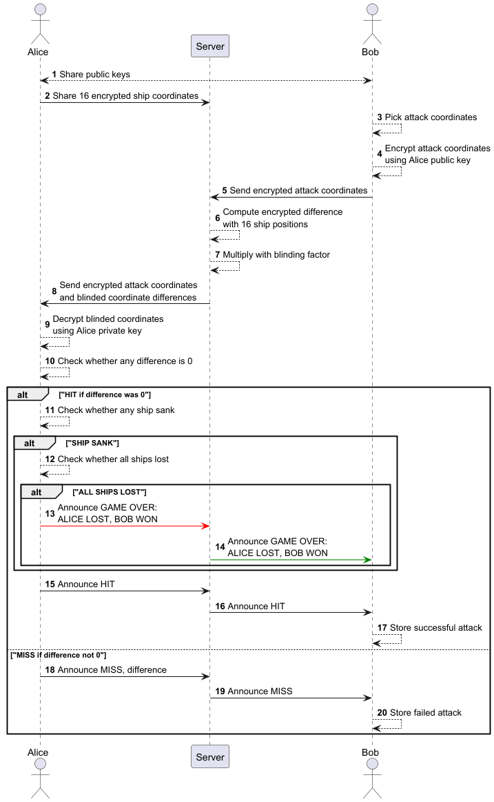

# Solution: Homomorphic encryption Battleship game improvements

This solution uses the Java crypto library called [bouncy castle](https://www.bouncycastle.org/)
for reading RSA keys. This open-source library is widely used.

# Structure

The project is structured as a Maven project with the following important packages:

- `org.finki.crypto.puru.exception` - contains custom exceptions for error handling
- `org.finki.crypto.puru.helper` - contains helper classes for loading data and initializing values
- `org.finki.crypto.puru.model` - contains data models used for this implementation
- `org.finki.crypto.puru.model.components` - related to the game, e.g. board, ship, attacks, etc.
- `org.finki.crypto.puru.model.messages` - message sent by server to defender and response from defender after attack
- `org.finki.crypto.puru.service` - contains service classes for entire game flow, implementation of Paillier crypto

- `src/main/resources/keys` - on running the init-certs script, this directory will be populated with RSA 2048 key and
  X.509 certs
- `src/main/resources/game_setup` - contains the board.txt and attacks.txt, used as input for alice and bob game setup

# Initial script

We first generate these files using the [`init-certs.sh`](./init-certs.sh) script:

- Private keys and self-signed certificates for Alice and Bob

Run from the project root folder (same folder containing this script file):

```shell
./init-certs.sh
```

After this, one can directly run the `main` method in the
[ApplicationEntrypoint.java](./src/main/java/org/finki/crypto/puru/ApplicationEntrypoint.java) file.

# Implementation

The flow is implemented based on the following sequence diagram:



The application entry point is the `Main` class located in the `org.finki.crypto.puru.ApplicationEntrypoint.java` file.

1. First, we initialize the players Alice and Bob by loading their private keys and certificates from the resources
   folder
2. Next, we initialize the Paillier cryptosystem private and public keys for each player based on the RSA generated p,q
   values
3. We initialize the game setup like reading the board and attacks for each player from the files under [
   `src/main/resources/game_setup/`](./src/main/resources/game_setup)
4. This code supports playing either in AUTO mode (default) where the attacks are pre-configured in the attacks.txt file
   for each player.
   Alternately, there's the INTERACTIVE mode which needs to be set in the `main` function in [
   `ApplicationEntrypoint.java`](./src/main/java/org/finki/crypto/puru/ApplicationEntrypoint.java).
   INTERACTIVE mode allows user input for the attack coordinates.
5. Initially, we set up the `Server` in the middle and store details about the other player in a game session.
   The `Server` also generates a blinding factor for each player based on the public key of each player.
   Similarly, the `Server` also stores the encrypted list of locations of ships for each player so that it can
   calculate the encrypted difference when one player attacks.
6. The first player to start becomes the attacker and picks a target coordinate in the grid by selecting row and column
   in the grid to attack ranging from [0, 9] both values included for row and column each.
7. The second player is the defender.
8. The attacker encrypts the target coordinates using the defender's public key and sends this encrypted value to the
   `Server`.
9. The `Server` computes the difference between this encrypted attack location and each of the encrypted ship locations
   of the defender.
10. The `Server` multiplies each difference with the blinding factor for the defender and sends this list of values to
    the defender.
11. The defender decrypts these blinded differences and finds out whether there was any HIT (difference was zero).
    1. If HIT, defender checks whether any ship sunk.
    2. If SHIP SANK, defender checks whether all ships sunk
    3. If ALL SHIPS LOST, defender announces game over!
12. If HIT or MISS, defender announces the result and the decrypted blinded differences
13. The attacker stores the last attack as successful or failed.
14. Game continues until one of the player loses all their ships!

## References

1. [Paillier cryptosystem](https://openmined.org/blog/the-paillier-cryptosystem/)
1. ChatGPT and GitHub Copilot for coding assistance
